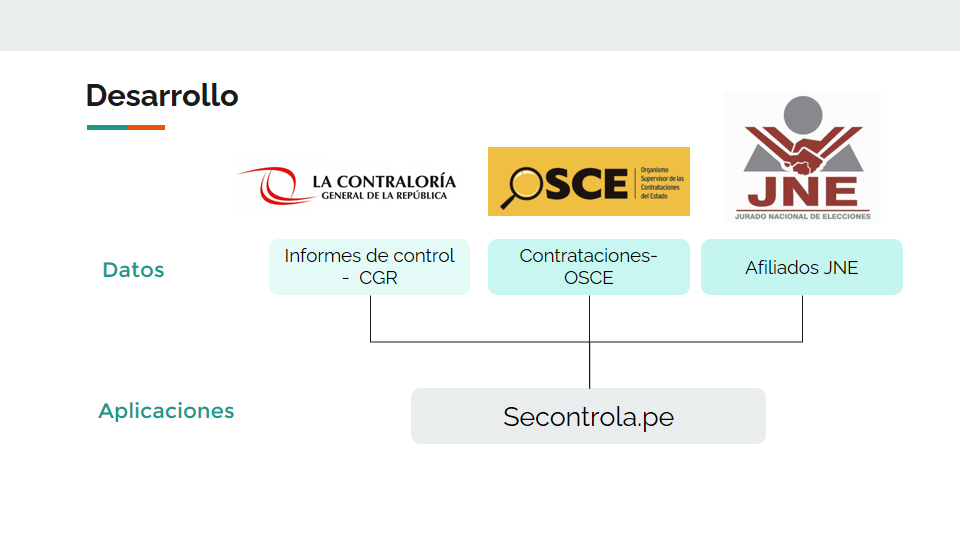
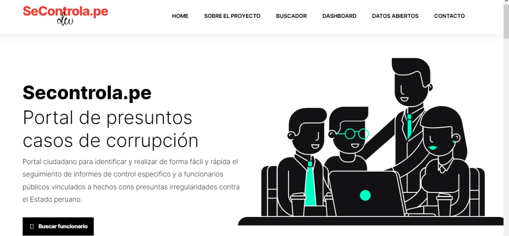
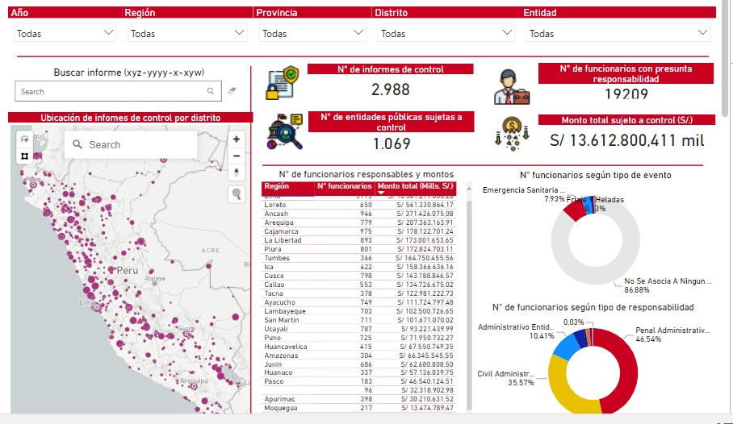
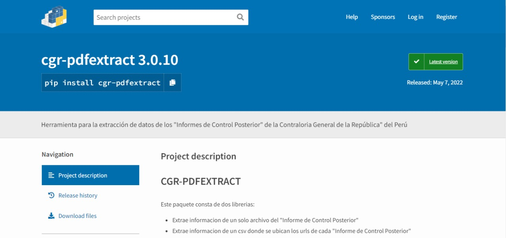

# DSRP | "Dataton por la Integridad y Lucha contra la Corrupción en Obras Públicas"

## Nombre de equipo : **DATA HUNTERS**

### I. Objetivo planteado
<em>Brindar una herramienta que permita a la CGR optimizar sus recursos humanos y capacidades, conociendo un perfil de las necesidades de control existentes..</em>

  

### II. Reto identificado para la 2da etapa:
#### Reto 06
**¿Cómo podemos ayudar a la vigilancia ciudadana identificando los proyectos de inversión, compras públicas u otras acciones del estado que tienen Informes de Control por parte de la Contraloría General de la República?**

**¿Cómo podemos identificar los proyectos de inversión, compras públicas y otras acciones que tienen informes de control en los que la Contraloría ha identificado posibles responsabilidades administrativas, civiles o penales por parte de los funcionarios o servidores del estado?**

### III. Distribución de los Datasets usados 

<ol>
<li><b> CGR | Contraloria General de la República </b></li>
   
<ul>
  <li><em>"informes_consolidado_nacional.csv"</em>: datasets que contiene la información de los informes de control posterior en la modalidad ""</li>
  <li><em>"padron_funcionarios_CGR.csv"</em>: datasets que contiene los nombres de las personas involucradas en presuntos actos irregulares contra el gobierno</li>
 </ul>
   
<li><b> OSCE | Organo Supervisor de las Contrataciones del Estado </b></li> 
   
<ul>
  <li><em>"1_conformacion_juridica_2022.csv"</em>: datasets que contiene la información de la conformación juridica de las empresas proveedoras con el estado</li>
  <li><em>"2_CONOSCE_MIEMBROCOMITE20**_0.xlsx"</em>: datasets que contiene los nombres de las personas que conformaron los miembros de los comites de selección de las convocatorias realizadas por el sector público</li>
 </ul>
   
<li><b> JNE | Jurado Nacional de Elecciones </b></li>
   
<ul>
  <li><em>"2_registro_movimientos_politicos_2022.csv"</em>: datasets que contiene el registro de las personas afiliadas a algun movimiento politico</li>
 </ul>
   
<li><b> CONSOLIDADO </b></li>
   
 <ul>
  <li><em>"1_osce_conformacion_juridica_2022.csv"</em>: consolidado con registros de los integrantes de la conformación juridica de los proveedores con el estado </li>
  <li><em>"2_osce_miembros_comite_2019_2022.csv"</em>: consolidado con los miembros de los comites de selección de las convocatorias realizadas </li>
  <li><em>"3_jne_movimientos_regionales_2022.csv"</em>: consolidado con registros de las personas que pertenencen a algun movimiento regional</li>
  <li><em>"4_informes_control_2019_2022.csv"</em>: consolidado de la información de los informes de control con las personas con presuntos actos irregulares hacia el estado.</li>
 </ul>
</ol>

### IV. Productos obtenidos

#### Portal web: <a href="https://neracs.github.io/secontrola/"> Secontrola.pe </a>
#### Buscador de informes de control 

Portal ciudadano para identificar y realizar de forma fácil y rápida el seguimiento de informes de control especifico y a funcionarios públicos vinculados a hechos con presuntas irregularidades contra el Estado peruano.

  

<b>Disclaimer: </b> <em>Los datos presentados en este portal web son obtenidos totalmente de entidades del estado peruano y constituyen información de carácter público. La misma que no tiene valor probatório ni legal y tampoco supone atribuir responsabilidad de ningún tipo a ninguna persona por parte del equipo desarrollador.</em>

<b>Estado: </b> <em>En desarrollo</em>

#### Dashboard: <a href="https://app.powerbi.com/view?r=eyJrIjoiMmRiY2M0ODAtYWQxMy00YTY0LThiYmMtNjdiZTBlZDg2NjZjIiwidCI6IjE3OWJkZGE4LWQ5NjQtNDNmZi1hZDNiLTY3NDE4NmEyZmEyOCIsImMiOjR9"> Informes de control en el Perú </a>
El Panel de Informes de control ha sido creado por el Secontrola.pe para realizar seguimiento a los informes de control en la modalidad "Servicio de control específico a hechos con presunta irregularidad" y su vinculación con las contrataciones, proyectos de inversión, vinculación política y más.

  

#### Paquete desarrollado: <a href="https://pypi.org/project/cgr-pdfextract/"> cgr-pdfextract 3.0.10 </a>

Herramienta para la extracción de datos de los "Informes de Control Posterior" de la Contraloria General de la República" del Perú
Este paquete consta de dos librerias: 

<ul>
<li>Extrae informacion de un solo archivo del "Informe de Control Posterior" </li>
<li>Extrae informacion de un csv donde se ubican los urls de cada "Informe de Control Posterior"</li>
</ul>

  

